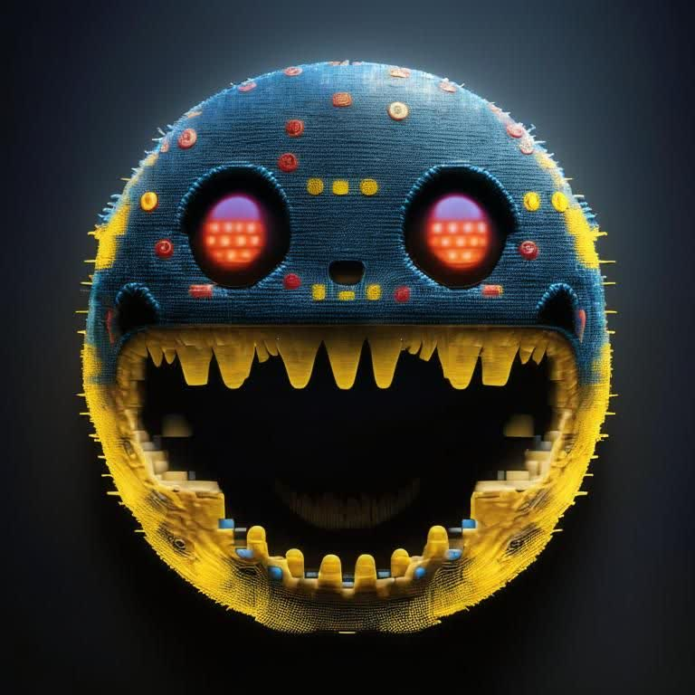
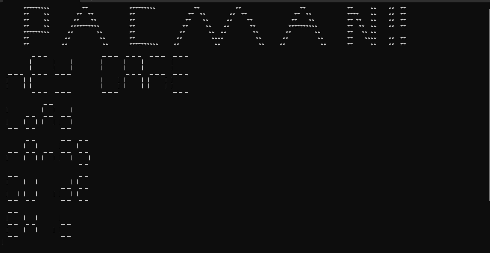
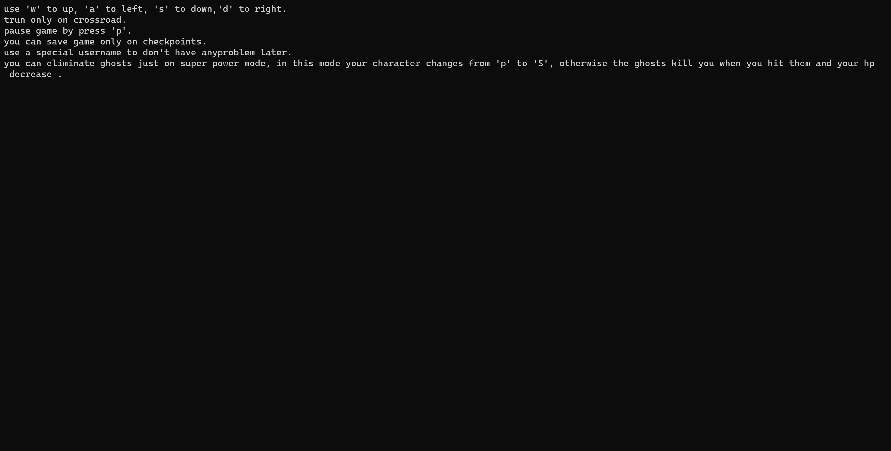
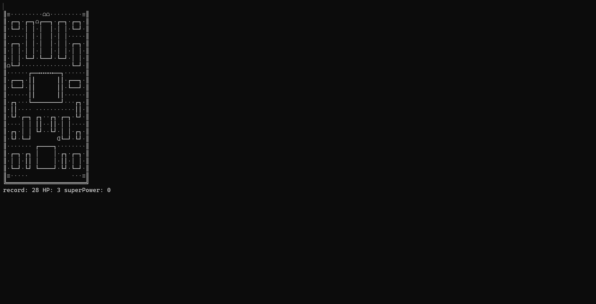

# OXDMan

## The nostalgia game Pacman

## This program is the result of collaboration of [seyed0123](https://github.com/seyed0123) and [Retriever5500](https://github.com/Retriever5500)
# how to use it:
- first to clone this repository and then compile the `main.cpp` in the scr directory and then run the app . this code also compiles in linux and windows flawlessly, but it runs better in Linux.
- second to use docker and pull the image of the game using this command `docker pull seyed0123/oxdman` and run it using `docker run -it --rm oxdman`. to get more info check the dockerHub repository of the project , follow this link [seyed0123/OXDMan](https://hub.docker.com/r/seyed0123/oxdman)
# main file
The main() function controls the flow of the game and calls other functions to create and display the game board, handle user input, and save and load game states. The function starts by including the necessary header files and declaring several variables, including the width, height, username, final record, and level of the game.

The showMenu() function is called to display the game menu, where the player can select the level, width, and height of the game board. The createDesirableMaze() function is called to create a maze of the desired width and height, and the move() function is called to simulate the game.

If the player completes a level, the function prompts the player to save the game at the current checkpoint. If the player chooses to save the game, the save() function is called to save the game state.

After completing all levels, the final score of the player is written to a file named ranks.pacman.

# Pacman Maze Generator
This code generates mazes for a Pacman-style game using the `randomFill` algorithm. The idea for this implementation was taken from [shaunlebron/pacman-mazegen](https://github.com/shaunlebron/pacman-mazegen).

Functions
The code provides the following functions:

- createEmptyMazeWithGhost: creates an empty maze with a ghost house in the center.
- addRandomBlock: adds a new block to a maze at a random location, and expands the walls of the maze accordingly.
- printMaze: prints a maze to the console.
- removeLastAxis: removes the last column of a maze.
- addPointsToMaze: adds power points to a maze by changing all empty spaces to 2's.
- addGhostHouse: adds a ghost house to the bottom-right of a maze.
- addSymmetryToMaze: adds symmetry to a maze by creating a mirrored copy of the maze and concatenating it to the original maze.
- createRandomMaze: generates a random maze by repeatedly calling addRandomBlock until no more blocks can be added. It then removes the last column of the maze, adds power points, a ghost house, and symmetry to the maze, and returns the resulting maze.
- isDesirable: checks whether a maze meets certain standards for playability. Specifically, it checks that there are no paths with a width or height greater than one, and that there are no dead-ends with more than two walls.
- addPowerPoints: adds power points to the four corners of a maze by changing certain cells to 3's.
- createDesirableMaze: repeatedly generates random mazes using createRandomMaze until a desirable maze is generated using isDesirable. It then adds power points to the maze and returns the resulting maze.
Usage
To use these functions, simply include the header file mazegen.h in your project. You can then create mazes using the createRandomMaze or createDesirableMaze functions, and manipulate the resulting maze using the other functions as needed.

# Pacman Game Mechanics in C++
This document explains the functions that implement Pacman game mechanics in C++. It covers the movement of ghost characters using AI algorithms, the movement of the Pacman character based on user input, and the display of the game board using Unicode characters. The move() function is also discussed, which simulates the movement of Pacman and ghosts in the game.

## Functions
The document describes several functions used in the Pacman game, including:

- superGhost() and ghostINTELEGENCEmove(): These functions implement the movement of ghost characters in the game using a simple AI algorithm that chooses the direction that brings the ghost closer to Pacman's current position. If the ghost has super power, the direction is chosen to move away from Pacman instead. Both functions call checkContradiction() to check if the ghost's new position collides with Pacman or another ghost. superGhost() is a variant of ghostINTELEGENCEmove() that is called when the ghost has been affected by a super power. In this case, the ghost's movement is reversed, i.e., it moves away from Pacman instead of towards him.

- ghostmove(): This function moves a single ghost character in the Pacman game. It takes several parameters, including the current position of the ghost, the current state of the game, and various game settings. The function first checks for any contradictions in the ghost's new position using the checkContradiction() function. It then generates a list of possible directions that the ghost can move in based on the maze layout and the positions of other characters. The function then updates the ghost's position and checks for any contradictions again. If the ghost collides with a wall, the function adjusts the ghost's position accordingly. If the ghost collides with another ghost, the function reverses the ghost's direction and moves it one step in the opposite direction.

- pacmanMove(): This function moves the Pacman character based on user input. It takes several parameters, including the current position of Pacman, the current direction of movement, the current state of the game, and various game settings. The function first checks if Pacman is about to eat a dot or a power pellet. If so, it updates the score and removes the dot or power pellet from the maze. If Pacman eats a power pellet, it sets the superPower variable to 20 (indicating that Pacman has a super power for 20 game steps). The function then updates Pacman's position based on the current direction. If Pacman collides with a wall, the function reverses Pacman's direction and moves it back one step. If Pacman collides with a ghost, the function checks if Pacman has a super power. If so, Pacman eats the ghost and the ghost is sent back to the ghost house. If Pacman does not have a super power, it loses a life and is sent back to the starting position.

- input(): This function takes user keyboard input and returns a point object representing the movement in the x and y directions. If the user inputs "a", the function returns a point with x = 0 and y = -1 (indicating movement to the left). If the user inputs "w", the function returns a point with x = -1 and y = 0 (indicating movement upwards). If the user inputs "s", the function returns a point with x = 1 and y = 0 (indicating movement downwards). If the user inputs "d", the function returns a point with x = 0 and y = 1 (indicating movement to the right). If the user inputs "e", the function exits the program. If the user inputs "p", the function waits for another input and returns a point with x = 0 and y = 0.

- chooseWallUnicode(): This function takes the row and column indices of a wall in the Pacman maze and returns the corresponding Unicode character to display that wall. The function first checks if the wall is one of the four corners of the maze, and returns the appropriate Unicode character for that corner. If the wall is on the top or bottom row of the maze but not in a corner, the function returns the Unicode character for a horizontal wall. If the wall is on the left or right column of the maze but not in a corner, the function returns the Unicode character for a vertical wall.

- move() Function
The move() function is the heart of the Pacman game mechanics in C++. It simulates the movement of Pacman and ghosts in the game. The function takes several input parameters, including the length and height of the game board, the starting positions of Pacman and the ghosts, the current level of the game, anda reference to the final game score. Inside the function, there are several variables and data structures used to keep track of the game state, including the maze layout, the positions of Pacman and ghosts, the current score, and the number of lives remaining. The function uses a loop to repeatedly update the game state based on user input and AI-controlled ghost movement until the game is over.

During each iteration of the loop, the function first checks if Pacman has eaten all the dots and power pellets in the maze. If so, the function updates the game level and resets the maze layout and character positions. The function then calls pacmanMove() to move Pacman based on user input and superGhost() and ghostINTELEGENCEmove() to move the ghosts based on AI algorithms. The function updates the game board display using Unicode characters and checks for collisions between Pacman and ghosts or walls. If Pacman collides with a ghost, the function checks if Pacman has a super power and updates the score and ghost positions accordingly. If Pacman collides with a wall, the function reverses Pacman's direction and moves it back one step. If Pacman eats a dot or power pellet, the function updates the score and removes the dot or power pellet from the maze. If Pacman loses all its lives, the function ends the game and displays the final score.

## Conclusion
This document provides a detailed explanation of the functions that implement Pacman game mechanics in C++. It covers the movement of ghost characters using AI algorithms, the movement of the Pacman character based on user input, and the display of the game board using Unicode characters. The move() function is also discussed, which simulates the movement of Pacman and ghosts in the game. The document provides a comprehensive overview of each function's working, including the variables used and the logic behind the algorithms.

# Shots of the game

